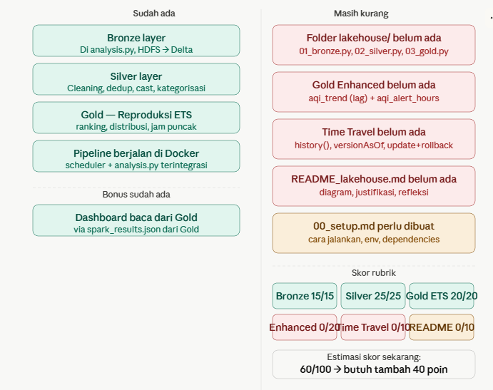

### Yang perlu dibuat

**1. Folder `lakehouse/` dengan 3 script terpisah** — tugas minta struktur spesifik ini, tidak bisa hanya dari `analysis.py` yang terintegrasi. Script harus bisa dijalankan standalone.

**2. Gold Enhanced — 2 tabel wajib untuk topik AQI:**

`gold/aqi_trend` — pakai Window Function `lag()` untuk lihat apakah AQI tiap kota membaik/memburuk antar observasi. Ini yang tidak bisa dibuat di ETS karena data JSON mentah tidak punya tipe Timestamp yang benar.

`gold/aqi_alert_hours` — hitung berapa jam berturut-turut kota dalam kondisi "Tidak Sehat" (AQI > 100). Pakai `sum().over(window)` dengan reset logic.

**3. Time Travel** — demonstrasi wajib 10 poin:
- Tulis Silver, lihat `history()`
- Lakukan `update()` (misalnya ubah semua kota jadi uppercase)
- Query `versionAsOf=0` untuk lihat data sebelum update
- Bandingkan hasilnya

**4. `README_lakehouse.md`** — dokumen dengan diagram sebelum/sesudah, justifikasi tiap transformasi Silver, dan refleksi Delta Lake vs HDFS biasa.